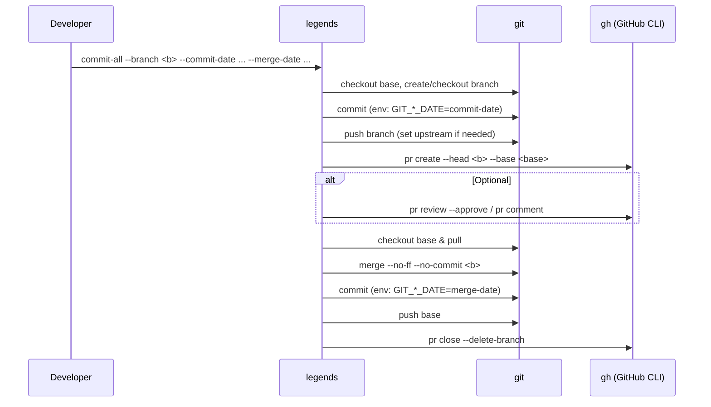
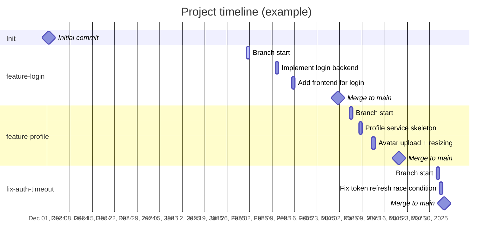

# legends

Automate **backdated** Git history (repositories, branches, commits, PRs, merges) using `git` and the GitHub CLI (`gh`).  
This tool lets you create a repository that *appears* to have evolved over time: you specify the dates and the CLI writes
commits and merge commits carrying those timestamps. PRs are orchestrated through `gh` for a realistic workflow.

> **Important limitation**: GitHub does **not** allow backdating PR creation, review, or comment timestamps.  
> legends backdates **commits** and **merge commits**. PRs, reviews, and comments will show the time you performed the action.

---

## Table of contents

- [legends](#legends)
  - [Table of contents](#table-of-contents)
  - [Features](#features)
  - [How it works (at a glance)](#how-it-works-at-a-glance)
  - [Flowcharts \& Diagrams](#flowcharts--diagrams)
    - [End-to-end `commit-all` flow](#end-to-end-commit-all-flow)
    - [Sequence: commit → PR → merge](#sequence-commit--pr--merge)
    - [Timeline (Gantt) example](#timeline-gantt-example)
    - [Configuration precedence](#configuration-precedence)
  - [Requirements](#requirements)
  - [Installation](#installation)
  - [Quickstart](#quickstart)
  - [CLI commands](#cli-commands)
    - [`create-repo`](#create-repo)
    - [`create-branch`](#create-branch)
    - [`commit`](#commit)
    - [`open-pr`](#open-pr)
    - [`merge-pr`](#merge-pr)
    - [`commit-all`](#commit-all)
  - [Configuration](#configuration)
    - [Example timeline spec (for a simple runner)](#example-timeline-spec-for-a-simple-runner)
  - [Environment variables](#environment-variables)
  - [Makefile \& scripts](#makefile--scripts)
  - [Examples](#examples)
  - [FAQ](#faq)
  - [Troubleshooting](#troubleshooting)
  - [Contributing](#contributing)
  - [License](#license)
    - [Notes for packagers](#notes-for-packagers)

---

## Features

- **Create repo** with a **backdated initial commit** (local + `gh repo create` push).
- **Create branch** and stamp its “birth” with a **backdated empty commit**.
- **Backdated commits** on any branch (`--allow-empty`, `--add-all`, `--touch` supported).
- **Open PR** via GitHub CLI.
- **Backdated merge commit** (performed locally with `--no-ff --no-commit`, then committed with a chosen date).
- **One-shot** **`commit-all`**: backdated commit → open PR → (optional review/comment) → backdated merge → cleanup.
- **Dry-run** mode (log commands without executing).
- **Configurable defaults** via YAML and environment variables (with clear precedence).
- Minimal dependencies (stdlib + optional `PyYAML` for YAML config).

---

## How it works (at a glance)

- Git commit timestamps are controlled by environment variables:
  - `GIT_AUTHOR_DATE` and `GIT_COMMITTER_DATE` are set to your desired **past** datetime.
  - legends normalizes input like `YYYY-MM-DD`, `YYYY-MM-DD HH:MM[:SS]`, ISO8601 (with `Z` or `+/-HH:MM`), treating **naïve** values as **local time**, then storing in **UTC**.
- Merge commits are created locally with those same variables and then pushed. GitHub recognizes the merge and will close the PR as merged.
- PRs, reviews, and comments are created through `gh`. Their timestamps cannot be backdated, but the merge commit itself is backdated and shows in the repo’s history accordingly.

---

## Flowcharts & Diagrams

> GitHub renders **Mermaid** diagrams in Markdown. If viewing locally, use a Markdown preview with Mermaid support.

### End-to-end `commit-all` flow

```mermaid
flowchart TD
    A[Run: legends commit-all] --> B[Checkout base branch]
    B --> C[Create/checkout feature branch]
    C --> D[Create change (or allow empty)]
    D --> E[Backdated commit on branch]
    E --> F[Push branch (upstream if first push)]
    F --> G[Open PR (gh)]
    G --> H{Optional review/comment?}
    H -->|Yes| I[gh pr review/comment]
    H -->|No| J[Skip]
    I --> K[Checkout base & pull]
    J --> K[Checkout base & pull]
    K --> L[Merge (no-ff, no-commit)]
    L --> M[Create merge commit (backdated)]
    M --> N[Push base]
    N --> O[Close PR & delete branch]
```

### Sequence: commit → PR → merge



### Timeline (Gantt) example

> Based on `config/timeline.example.yaml` (for inspiration; you can build a small runner to drive these steps).



### Configuration precedence

```mermaid
flowchart LR
    A[Project defaults] --> B[YAML file (--config)]
    B --> C[Environment variables]
    C --> D[CLI flags]
    D --> E[Effective runtime config]
```

- Precedence: **CLI flags** → **Environment** → **YAML** → **Defaults**.

---

## Requirements

- **Git** (on `PATH`)
- **GitHub CLI** (`gh`) with auth: `gh auth login` (or `GITHUB_TOKEN`/`GH_TOKEN`)
- **Python** 3.9+
- Optional: **PyYAML** (auto-installed by the package) for reading YAML config

---

## Installation

Using the included Makefile:

```bash
make install            # creates .venv and installs legends in editable mode
. .venv/bin/activate    # activate the virtualenv
legends --help
```

Or manually:

```bash
python3 -m venv .venv
source .venv/bin/activate
python -m pip install --upgrade pip
pip install -e .
```

---

## Quickstart

Create a repo whose **initial commit** is backdated to **Dec 1, 2024** (private by default):

```bash
legends create-repo my-backdated-repo   --owner your-username-or-org   --date "2024-12-01T12:00:00"   --private   --description "Backdated repo demo"
```

Create a **feature branch** with a backdated **birth commit**:

```bash
legends create-branch feature-login   --base main   --date "2025-02-01T09:00:00"   --message "chore(feature-login): branch birth @ 2025-02-01T09:00:00"   --push
```

Make **backdated commits** on that branch:

```bash
legends commit --branch feature-login   --date "2025-02-10T15:00:00" --message "Implement login backend" --add-all --push

legends commit --branch feature-login   --date "2025-02-15T10:30:00" --message "Add frontend for login" --add-all --push
```

Open a PR and **merge with a backdated merge commit**:

```bash
legends open-pr --branch feature-login --base main   --title "Feature: User Login"   --body "Adds backend + UI for user login."

legends merge-pr --branch feature-login --base main   --date "2025-03-01T17:00:00" --delete-branch
```

Run the **one-shot flow**:

```bash
legends commit-all   --base main   --branch feature-login   --commit-date "2025-02-10T15:00:00"   --message "Implement login"   --pr-title "Feature: Login"   --pr-body "Adds backend + UI."   --merge-date "2025-03-01T17:00:00"   --delete-branch
```

---

## CLI commands

> Run `legends --help` for details; highlights below.

### `create-repo`

Create a repo from the local folder with a **backdated initial commit** and push it via `gh`.

```bash
legends create-repo <name>   [--owner <org-or-user>] [--description <text>]   [--branch <main|trunk|…>] [--message "Initial commit"]   [--date "<ISO or YYYY-MM-DD HH:MM:SS>"]   [--author-name <name>] [--author-email <email>]   [--private|--public] [--remote origin]
```

### `create-branch`

Create a branch from base and record its **birth** via an **empty backdated commit**.

```bash
legends create-branch <branch>   [--base main] --date "<ISO>" [--message "..."] [--push]
```

### `commit`

Make a **backdated** commit on a branch; can stage all or `--touch` a file.

```bash
legends commit --branch <branch> --date "<ISO>"   --message "..." [--allow-empty] [--add-all] [--touch <path>] [--push]
```

### `open-pr`

Open a PR via GitHub CLI.

```bash
legends open-pr --branch <head> [--base main] [--title ...] [--body ...] [--draft]
```

### `merge-pr`

Perform a **local, backdated** merge commit and push; closes the PR & optionally deletes the branch.

```bash
legends merge-pr [--branch <head> | --pr <number>]   [--base main] --date "<ISO>" [--message "..."] [--delete-branch|--no-delete-branch]
```

### `commit-all`

One-shot: backdated commit → open PR → optional review/comment → backdated merge → cleanup.

```bash
legends commit-all --branch <branch> [--base main]   --commit-date "<ISO>" --message "..."   [--touch <path>] [--allow-empty]   [--pr-title ...] [--pr-body ...] [--draft]   --merge-date "<ISO>" [--delete-branch]
  [--review] [--review-body "..."] [--comment "..."]
```

---

## Configuration

Built-in defaults: `config/defaults.yaml`

```yaml
base_branch: main
remote_name: origin
visibility: private
owner: null
author:
  name: ""
  email: ""
token_env: GITHUB_TOKEN
# dry_run: false
```

- Use `--config <path/to/yaml>` to load a file with the same keys.
- Precedence: **CLI flags** → **Environment** → **YAML** → **Defaults**.

### Example timeline spec (for a simple runner)

See `config/timeline.example.yaml` for a year-like schedule (repo init, three features & merges).  
You can write a tiny wrapper that reads this YAML and invokes the CLI in order.

---

## Environment variables

- **Auth**: `GITHUB_TOKEN` or `GH_TOKEN` (or run `gh auth login` interactively).
- **CLI defaults** (override anything in YAML):
  - `GHB_VISIBILITY` = `private|public`
  - `GHB_BASE_BRANCH` (default base branch)
  - `GHB_REMOTE` (default remote name)
  - `GHB_OWNER` (default GitHub owner/org)
  - `GHB_DRY_RUN` = `1|true` to log without executing
- **Identity overrides** (used if set; otherwise your git global config is used):
  - `GIT_AUTHOR_NAME`, `GIT_AUTHOR_EMAIL`
  - `GIT_COMMITTER_NAME`, `GIT_COMMITTER_EMAIL`

---

## Makefile & scripts

- `make install`, `make verify-env`, `make run-help`
- Workflow helpers:
  - `make create-repo`
  - `make create-branch`
  - `make commit`
  - `make open-pr`
  - `make merge-pr`
  - `make commit-all`
- Scripts:
  - `scripts/verify_env.sh` – checks git, gh, auth, identity
  - `scripts/install.sh` – venv + install (with `--dev` extras)
  - `scripts/bootstrap_repo.sh` – create a repo w/ backdated initial commit
  - `scripts/commit_all.sh` – one-shot flow wrapper

---

## Examples

Create three branches and simulate a small quarter of activity (dates are illustrative):

```bash
# Repo created "last December"
legends create-repo quarterly-demo --date "2024-12-01T10:00:00" --private

# Feature A
legends create-branch feature-a --date "2025-02-01T09:00:00" --push
legends commit --branch feature-a --date "2025-02-05T14:00:00" --message "feat(a): add core" --allow-empty --push
legends open-pr --branch feature-a --title "Feature A"
legends merge-pr --branch feature-a --date "2025-02-20T16:00:00" --delete-branch

# Feature B (one-shot)
legends commit-all --branch feature-b --commit-date "2025-03-10T11:00:00"   --message "feat(b): initial" --pr-title "Feature B"   --merge-date "2025-03-18T18:00:00" --delete-branch

# Hotfix
legends commit-all --branch hotfix-timeout --commit-date "2025-04-02T09:00:00"   --message "fix: token refresh race" --pr-title "Fix: auth token refresh race"   --merge-date "2025-04-03T13:00:00" --delete-branch
```

---

## FAQ

**Q: Will these backdated commits affect my GitHub contribution graph?**  
A: Yes—contributions are based on commit metadata and email attribution. Use responsibly.

**Q: Can I backdate PR creation/merge timestamps shown on the PR page?**  
A: No. GitHub records those server-side when the action occurs. Only commits (including merge commits) can be backdated.

**Q: Do I need to force-push?**  
A: Not for normal use. Only if you later rewrite history. Be careful with `--force` on shared repos.

**Q: What date formats are accepted?**  
A: `YYYY-MM-DD`, `YYYY-MM-DD HH:MM[:SS]`, ISO8601 (`...T...`), with optional `Z` or an offset like `+02:00`. Naïve times are treated as local time and normalized to UTC internally.

---

## Troubleshooting

- Run `scripts/verify_env.sh` to check prerequisites and auth.
- Ensure `git config user.name` and `user.email` are set (or provide `--author-*` / env overrides).
- If `gh` prompts for login, run `gh auth login` or set `GITHUB_TOKEN`/`GH_TOKEN`.
- If `gh pr create` cannot resolve a PR number immediately, we query it via `gh pr list --head <branch>`.
- On merge: we use `git merge --no-ff --no-commit` followed by a **backdated** `git commit -m ...` then `git push` the base branch.

---

## Contributing

- PRs welcome for: a YAML timeline runner, richer templates, additional safety checks, and Windows support.
- Dev setup: `scripts/install.sh --dev`, run `ruff`, `black`, and `pytest` as needed.

---

## License

MIT – see [`LICENSE`](LICENSE).

---

### Notes for packagers

- `pyproject.toml` declares `readme = "README.md"` – keep this file at the project root.
- Non-Python templates are included under `gh_backdate/templates/` in the wheel.
