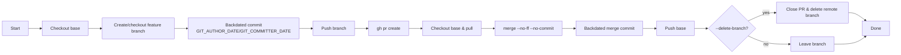
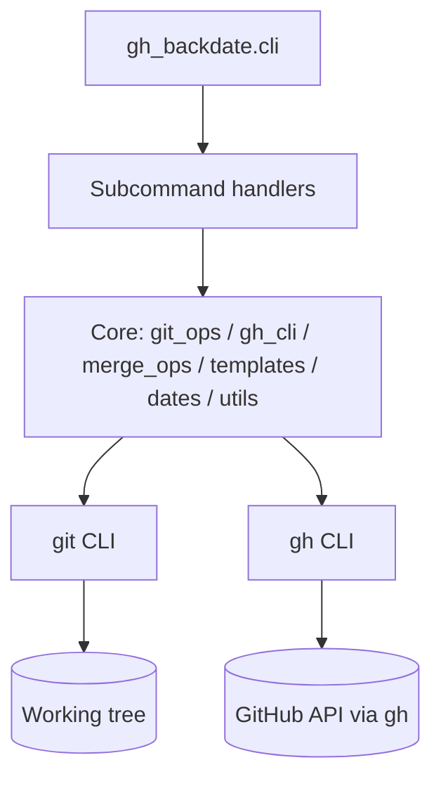

# legends — Overview

Automate **historical Git history** on GitHub by creating repositories, branches, commits, pull requests, and **backdated merge commits** using your local `git` plus the GitHub CLI (`gh`).

- **Use cases**: rebuild a realistic activity timeline for demos, workshops, case studies, classroom exercises, or internal testing.
- **What it *can* backdate**: commit timestamps (author/committer) and merge commit timestamps.
- **What it *cannot* backdate**: server-side events like PR *creation time*, comments, and reviews — those will always reflect when you ran the command.

> **Status & entrypoint**: The console script is `legends` (see `pyproject.toml`). The main entrypoint is `gh_backdate.cli:main`.

---

## Features at a glance

- `create-repo` — create a repo with a **backdated initial commit** and push it to GitHub.
- `create-branch` — create a feature branch with a **backdated “birth” commit** (pushed to origin).
- `commit` — make a **backdated commit** on a branch (and push).
- `open-pr` — open a pull request via `gh` (real-time on GitHub).
- `merge-pr` — perform a local **no‑ff merge** with a **backdated merge commit**, then push; optionally delete the remote branch.
- `commit-all` — one-shot: backdated commit → open PR → backdated merge → (close PR & delete branch).

> **Heads‑up**: In `v0.1.0`, `create-branch` and `commit` **push automatically**; there is no `--push` flag on the main CLI. The helper scripts under `scripts/` work with this behavior. If you see `--push` in the Makefile, remove it or update your CLI accordingly.

---

## How it works (high level)

- Dates are normalized to UTC and injected via standard git env vars: `GIT_AUTHOR_DATE` and `GIT_COMMITTER_DATE`.
- The tool shells out to `git` and `gh` (no heavy dependencies).
- The **merge** flow uses `git merge --no-ff --no-commit` followed by a single backdated `git commit` to produce a merge commit with the desired timestamp.

### End‑to‑end “commit-all” flow



### Component architecture



---

## Repository layout

```
config/                     # defaults + timeline example
scripts/                    # helper shell scripts (install, verify, bootstrap, commit_all)
src/gh_backdate/            # package source
  ├─ cli.py                 # main entrypoint
  ├─ core/                  # thin wrappers around git/gh + merge orchestration
  ├─ commands/              # alt command layer (used by scripts, not the default entrypoint)
  ├─ templates/             # message/body templates
Makefile                    # developer shortcuts (adapt flags to your CLI version)
pyproject.toml              # packaging + console_scripts
```

---

## What backdating changes in GitHub UI

- The **commit graph** and **commit list** reflect the backdated timestamps.
- PR metadata like **“Opened on …”** and **comments/reviews** reflect real time when executed.
- The PR page may show a “Merged” banner referencing the merge commit; the **merge commit** itself carries the backdated time.

See **docs/10-limitations.md** for a precise list of guarantees and caveats.
