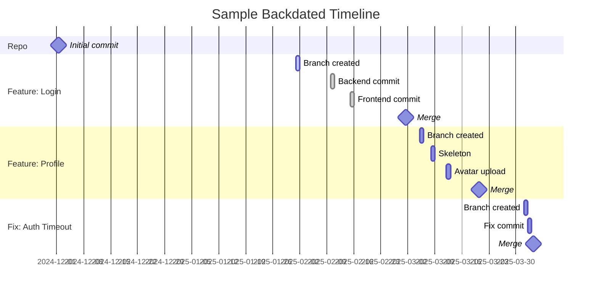

# Timeline mode (advanced)

The repository includes a **worked example** of a yearly timeline at `config/timeline.example.yaml`. This file is **not** executed by the CLI directly; it is intended for a small “runner” that loads the YAML and calls the CLI commands in order.

## YAML schema (example)

```yaml
repo: backdated-annual-demo
owner: your-username-or-org
visibility: private
base_branch: main
remote_name: origin

initial_commit:
  date: "2024-12-01T12:00:00"
  message: "Initial commit"
  description: "Repository initialized for backdated demo"

features:
  - branch: feature-login
    start_date: "2025-02-01T09:00:00"
    commits:
      - date: "2025-02-10T15:00:00"
        message: "Implement login backend"
      - date: "2025-02-15T10:30:00"
        message: "Add frontend for login"
    pr:
      title: "Feature: User Login"
      body: |
        Adds backend + UI for user login.
        - JWT-based sessions
        - Form validation
      merge_date: "2025-03-01T17:00:00"

  - branch: feature-profile
    start_date: "2025-03-05T10:00:00"
    commits:
      - date: "2025-03-08T11:20:00"
        message: "Profile service skeleton"
      - date: "2025-03-12T14:05:00"
        message: "Avatar upload + resizing"
    pr:
      title: "Feature: User Profile"
      body: "Adds profile pages and avatar upload."
      merge_date: "2025-03-20T16:30:00"

  - branch: fix-auth-timeout
    start_date: "2025-04-01T08:00:00"
    commits:
      - date: "2025-04-02T09:00:00"
        message: "Fix token refresh race condition"
    pr:
      title: "Fix: auth token refresh race"
      body: "Stabilizes refresh flow under intermittent network failures."
      merge_date: "2025-04-03T13:00:00"

author:
  name: "Your Name"
  email: "you@example.com"
```

### Interpreting the YAML

- `initial_commit`: create the repo and backdate the first commit.
- For each entry in `features`:
  1. `create-branch` at `start_date` (a backdated “birth” commit).
  2. For each `commits[*]`: `commit` with the given date/message.
  3. `open-pr` with `title`/`body`.
  4. `merge-pr` with `merge_date` (backdated) and delete the branch.

> The runner can inject `author.name`/`author.email` into `GIT_*` env vars if you’d like all backdated commits to use a fixed identity.

---

## Minimal Python runner (illustrative)

> This snippet shows the idea. Save as `scripts/run_timeline.py` if useful. It requires **PyYAML** (already a dependency).

```python
import subprocess, os, yaml, sys

with open("config/timeline.example.yaml", "r", encoding="utf-8") as f:
    t = yaml.safe_load(f)

owner = t.get("owner") or ""
repo = t["repo"]
base = t.get("base_branch", "main")

# 1) create repo
subprocess.run([
  "legends","create-repo",repo,"--branch",base,
  "--description", t["initial_commit"].get("description",""),
  "--date", t["initial_commit"]["date"],
  "--private" if t.get("visibility","private")=="private" else "--public",
  *([] if not owner else ["--owner", owner]),
], check=True)

# 2) features
for ftr in t.get("features", []):
  br = ftr["branch"]
  # birth
  subprocess.run(["legends","create-branch",br,"--base",base,"--date",ftr["start_date"]], check=True)
  # commits
  for c in ftr.get("commits", []):
    subprocess.run(["legends","commit","--branch",br,"--date",c["date"],"--message",c["message"]], check=True)
  # pr & merge
  pr = ftr.get("pr",{})
  subprocess.run([
    "legends","open-pr","--branch",br,"--base",base,
    *([] if not pr.get("title") else ["--title",pr["title"]]),
    *([] if not pr.get("body") else ["--body",pr["body"]]),
  ], check=True)
  subprocess.run(["legends","merge-pr","--branch",br,"--base",base,"--date",pr["merge_date"]], check=True)
```

---

## Visualizing a timeline


